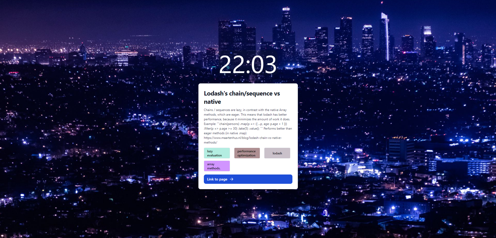
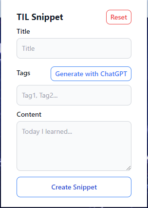

# DO NOT USE
Working on a v2 now, v1 failing due to CORS issue from Notion. 

# TIL Notion-ChatGPT Chrome Extension
This is a chrome extension that enables users to take notes using Notion and ChatGPT and save them to their Notion account. The extension uses OpenAI's GPT-3.5 architecture to generate snippets of information that can be quickly saved as notes. These notes then show up in the form of a card on the "New Tab" page, serving as reminders of what the user has learned.

## Features
- Take notes using Notion and ChatGPT
- Save notes to your Notion account
- Tags for the notes generated by GPT-3.5
- Notes displayed as cards on the "New Tab" page for quick reference

## Installation
To use this extension, follow these steps:

1. Clone the repository to your local machine.
2. Open Google Chrome and go to chrome://extensions.
3. Enable Developer Mode.
4. Click on "Load unpacked" and select the cloned repository folder.
5. The extension should now be installed and ready to use.

## Usage
To use the extension, follow these steps:

1. Click on the extension icon in the Chrome toolbar.
2. Enter your Notion API key, database ID, and openai key. (These will be saved locally)
3. Click on the Chrome extension icon to create a new note.

4. Type in your note and title, and optionally click on "Generate" to generate tags for the note (or type them in manually, separated by commas).
5. Click on the "Save" button to save it to your Notion account.
6. Your note will now show up as a card on the "New Tab" page, with a button on the bottom to visit the page in Notion.

## Contributing
Contributions are welcome!
If you want to contribute to this project, please follow these steps:

1. Fork the repository.
2. Create a new branch.
3. Make your changes.
4. Push your changes to your fork.
5. Submit a pull request.

## License
This project is licensed under the MIT License. See the [LICENSE](./LICENSE) file for more information.